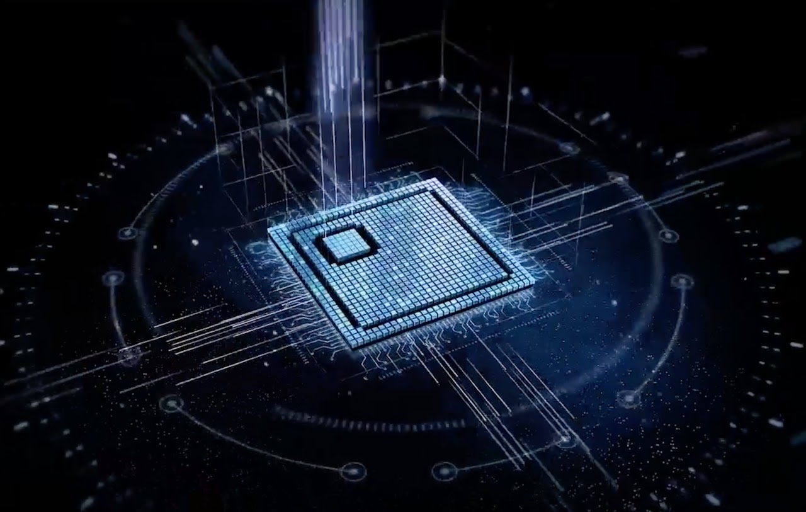
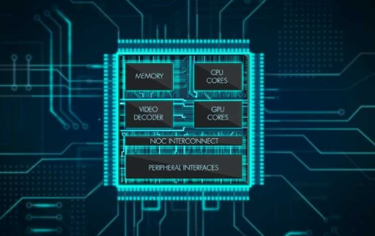
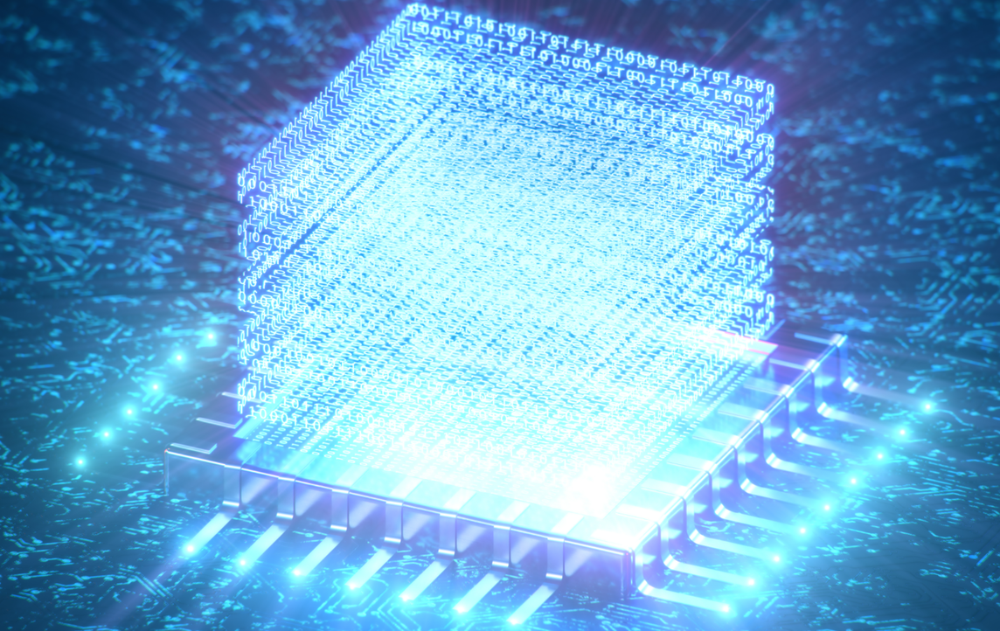

---
# Leave the homepage title empty to use the site title
title:
date: 2022-10-24
type: landing

sections:
  - block: markdown
    content:
      title: 
      subtitle: 
      text: |
        

        

          
        

    design:
      columns: '1'

  - block: markdown
    content:
      title: Welcome to INTELLIGENT DATA-CENTRIC EMERGING ARCHITECTURE LAB(IDEA.L) at SKKU.
      subtitle: 
      text: |
        

        

         

        IDEA 연구실에서는 반도체 칩으로 구현되는 System-on-Chip (SoC) 아키텍처와 설계 기술에 관련된 하드웨어와  소프트웨어에서의 다양한 문제들을 연구하고 있습니다. 최근 우리는 빅 데이터와 인공지능 어플리케이션에서 기인하는  메모리 및 스토리지 데이터 병목현상을 해결하기 위한 지능형 데이터 중심 컴퓨팅 아키텍처, optical link를 포함하는  차세대 온칩 인터커넥트 등의 분야에서 시스템 레벨 연구에 초점을 맞추고 있습니다.  

        The IDEA lab is investigating various hardware and software challenges related to System-on-Chip (SoC)  architecture and design technology implemented as semiconductor chips. We have recently focused on  system-level research in intelligent data-driven computing architectures to address memory and storage  data bottlenecks caused by big data and artificial intelligence applications, as well as next-generation  on-chip interconnects including optical links.
        

         
        {}
    design:
      columns: '1'

  - block: markdown
    content:
      title: 
      subtitle: 
      text: |
        

        

          <h2><b>Research Area</b></h2>
        

         

        

          <figure>
            
            <figcaption><b>AI Acceleration</b></figcaption>
          </figure>
          <figure>
            
            <figcaption><b>SoC On-Chip Network</b></figcaption>
          </figure>
          <figure>
            
            <figcaption><b>Near Data Processing</b></figcaption>
          </figure>
          <figure>
            
            <figcaption><b>Next Generation Memory</b></figcaption>
          </figure>
        

    design:
      columns: '1'

      
  
  - block: collection
    content:
      title: News
      subtitle:
      text:
      count: 5
      filters:
        author: ''
        category: ''
        exclude_featured: false
        publication_type: ''
        tag: ''
      offset: 0
      order: desc
      page_type: post
    design:
      view: card
      columns: '1'

##
  - block: collection
    content:
      title: Latest Preprints
      text: ""
      count: 5
      filters:
        folders:
          - publication
        publication_type: 'article'
    design:
      view: citation
      columns: '1'

---
